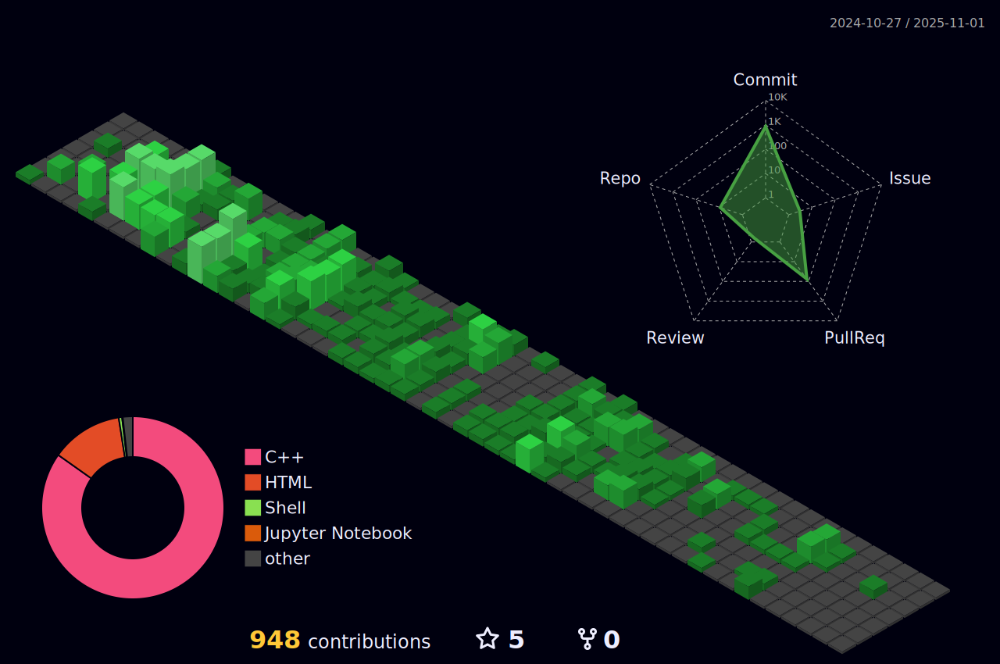

  
|  |  |  
| ----------- | ----------- |

  
   

##

  

##
<!--

  <a href=""><a/>
  <a href=""><a/>
  <a href=""><a/>
  <a href=""><a/>

-->

Copyright &copy; 2025 <a href="https://raphaelkaique1.github.io/raphaelkaique1/main">Raphael Kaíque Dias Santos</a>

